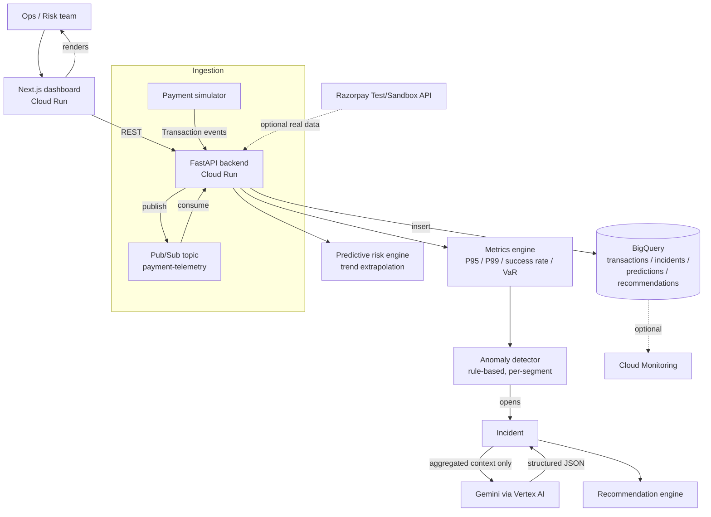

# Architecture — RazorPay Pulse

## System diagram

## Why this shape

- **Repository pattern on the backend** (`DataStore`, `AIProvider` interfaces) means the exact same FastAPI code runs against `InMemoryStore` + `MockAIProvider` locally with zero GCP dependency, or `BigQueryStore` + `VertexAIProvider` in production — flipped entirely by `.env`, no code changes.
- **Aggregation before AI.** The backend never sends raw transaction rows to Gemini. It computes P95/P99 ratios, failure-rate deltas, and top-affected-region first, then sends that small structured JSON — matching the brief's explicit instruction and keeping token cost low.
- **Simulator is a first-class backend service**, not a frontend mock — this way the same injected degradation is visible identically through the API, the dashboard, and (later) a real Pub/Sub-based ingestion path.
- **Detection windows are short (~20s current / ~2.5min baseline)** rather than the more "textbook" 15-minute windows, because a live buildathon demo needs an incident to appear within about a minute of the judge clicking "inject," not twelve minutes later.

## Data flow for the demo scenario

1. Simulator continuously generates baseline UPI/card/netbanking/wallet traffic across the full Payment Journey.
2. Judge triggers `POST /api/simulator/inject-latency` (bank stage, UPI, 4000ms).
3. Next transactions generated for UPI carry the injected bank latency.
4. Every 5 backend ticks (~5s), the anomaly detector compares the last ~20s window against the prior baseline window per payment method.
5. If P95 ratio or failure-rate delta crosses threshold, an `Incident` is created and persisted.
6. Dashboard (polling every 3–4s) picks up the new incident and updated health status.
7. Judge opens the incident, clicks "Run analysis" → backend aggregates fresh telemetry, sends it to the `AIProvider` (mock or Gemini), gets back structured root-cause JSON, validates it, stores it on the incident, and generates advisory recommendations.
8. Judge resets the simulator or lets the injection expire → traffic recovers → before/after P95 is visible on the Overview latency chart.

## Deployment topology (target)

| Component | Service |
|---|---|
| Frontend | Cloud Run (Next.js standalone server) |
| Backend | Cloud Run (FastAPI + Uvicorn) |
| Transaction/incident/prediction/recommendation storage | BigQuery |
| Async telemetry ingestion (production path) | Pub/Sub → Cloud Run push subscription |
| Root-cause analysis | Vertex AI (Gemini) |
| Observability | Cloud Monitoring (optional, not required for MVP) |
| Real payment data (optional) | Razorpay Test/Sandbox API |

See `README.md` for local run and GCP deployment instructions.
